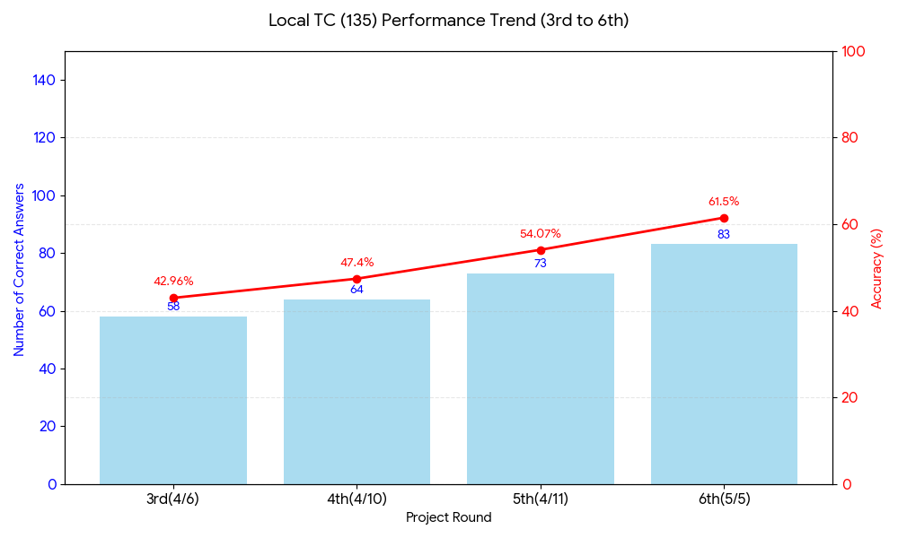
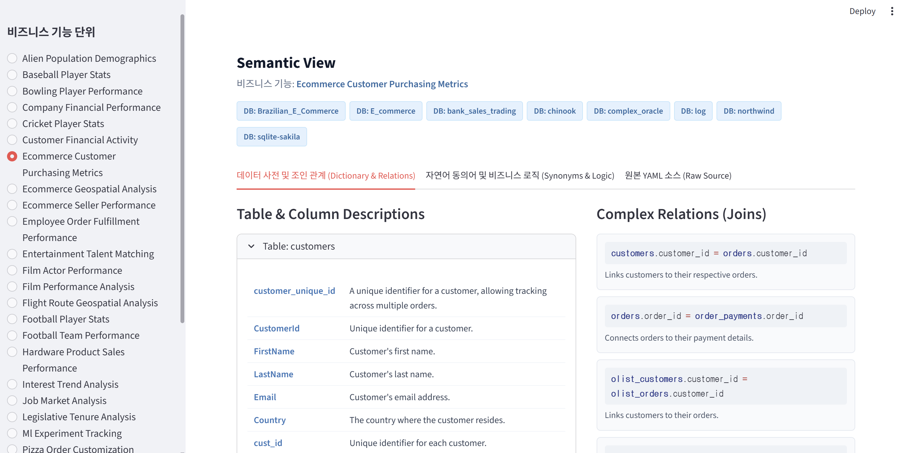

### 전체 DB 정확도

| 데이터베이스 (DB Name)           | 전체 문항 | 맞음 (1) | 틀림 (0) | 정답률 (%) |
| :------------------------------- | :-------: | :------: | :------: | :--------: |
| **bank_sales_trading**           |    15     |    11    |    4     |   73.3%    |
| **IPL**                          |    11     |    8     |    3     |   72.7%    |
| **city_legislation**             |    10     |    9     |    1     |   90.0%    |
| **f1**                           |     9     |    4     |    5     |   44.4%    |
| **oracle_sql**                   |     8     |    3     |    5     |   37.5%    |
| **Brazilian_E_Commerce**         |     8     |    6     |    2     |   75.0%    |
| **modern_data**                  |     7     |    6     |    1     |   85.7%    |
| **sqlite-sakila**                |     7     |    6     |    1     |   85.7%    |
| **complex_oracle**               |     6     |    2     |    4     |   33.3%    |
| **education_business**           |     5     |    4     |    1     |   80.0%    |
| **log**                          |     5     |    1     |    4     |   20.0%    |
| **Db-IMDB**                      |     5     |    1     |    4     |   20.0%    |
| **EU_soccer**                    |     5     |    3     |    2     |   60.0%    |
| **delivery_center**              |     3     |    2     |    1     |   66.7%    |
| **EntertainmentAgency**          |     3     |    2     |    1     |   66.7%    |
| **chinook**                      |     3     |    3     |    0     |   100.0%   |
| **stacking**                     |     3     |    3     |    0     |   100.0%   |
| **E_commerce**                   |     3     |    1     |    2     |   33.3%    |
| **California_Traffic_Collision** |     3     |    0     |    3     |    0.0%    |
| **Airlines**                     |     2     |    0     |    2     |    0.0%    |
| **Baseball**                     |     2     |    1     |    1     |   50.0%    |
| **imdb_movies**                  |     2     |    1     |    1     |   50.0%    |
| **Pagila**                       |     2     |    1     |    1     |   50.0%    |
| **northwind**                    |     2     |    2     |    0     |   100.0%   |
| **AdventureWorks**               |     1     |    1     |    0     |   100.0%   |
| **BowlingLeague**                |     1     |    1     |    0     |   100.0%   |
| **WWE**                          |     1     |    1     |    0     |   100.0%   |
| **school_scheduling**            |     1     |    0     |    1     |    0.0%    |
| **music**                        |     1     |    0     |    1     |    0.0%    |
| **electronic_sales**             |     1     |    0     |    1     |    0.0%    |
| **합계**                         |  **135**  |  **83**  |  **52**  | **61.5%**  |

| Final Score (%) | Zero-Retry Score (%) | Avg Retries | Avg Steps | Correct | Total |
| --------------- | -------------------- | ----------- | --------- | ------- | ----- |
| 64.34           | 51.94                | 0.67        | 4         | 83      | 129   |

### 개발 상세

#### Workflow

```txt
[ START ]
    │
    ▼
1. Keyword_Extraction
    │ (질문 의도 파악, 키워드 및 SQL 뼈대 추출)
    ▼
2. Schema_Linking
    │ (키워드 기반 관련 테이블/컬럼 추출 및 스키마 축소)
    ▼
3. Data_Profiling
    │ (샘플 쿼리를 통해 실제 데이터 형식/값 사전 매핑)
    ▼
4. Query_Planning
    │ (스키마, 프로파일링, 룰 기반 단계별 CTE 실행 계획 수립)
    ▼
5. SQL_Writer
    │ (계획을 바탕으로 최초 SQL 작성: EXPLORE 또는 FINAL)
    ▼
┌▶ 6. Execution ──────────────────────────────┐
│   │ (SQL 실제 DB 실행, 문법 검증, 무한루프 방지) │
│   ▼                                         │
│ [ route_after_execution ]                   │
│   │                                         │
│   ├─ "retry" (에러 발생 또는 EXPLORE 시) ────┼──▶ 8. SQL_Modifier
│   │                                         │     │ (에러/피드백 기반 쿼리 수정)
│   └─ "critic" (성공 및 FINAL SQL인 경우) ────┤     │
│                                             │     ▼
│ 7. Critic (비평가)                           │  (Execution으로 다시 루프)
│   │ (결과 논리 검증 및 벤치마크 룰 엄격 체크) │
│   ▼                                         │
│ [ route_after_critic ]                      │
│   │                                         │
│   ├─ "retry" (Critic 로직 반려 시) ──────────┘
│   │
│   └─ "end" (Critic 통과 시) ────────────────┐
│                                             │
└─────────────────────────────────────────────┼─────▶ [ END ]
                                              │ (또는 Max Steps 초과 시 강제 종료)
```

준비 및 계획 (Flash 모델 활용)

- Keyword Extraction: 질문에서 엔티티와 의도를 파악하고 SQL 뼈대를 추출합니다.

- Schema Linking: 전체 스키마 중 질문 해결에 필수적인 테이블/컬럼만 선별하여 컨스트럭트합니다.

- Data Profiling: DB 값을 직접 조회하여 'USA'가 'United States'로 저장되어 있는지 등을 사전 확인합니다.

- Query Planning: CTE(Common Table Expression)를 활용하여 논리적 단계를 세분화합니다.

작성 및 검증 (Pro 모델 활용)

- SQL Writer(flash): 계획과 지식 베이스를 바탕으로 최초의 실행 가능한 쿼리를 작성합니다.

- Execution: sqlglot으로 구문을 검사하고 실제 DB에서 실행하여 결과를 미리 확인합니다.

- Critic (비평가): 결과가 0행이거나 비즈니스 규칙(도메인 가이드라인) 위반 여부를 엄격히 심사합니다.

- SQL Modifier: 에러 메시지나 Critic의 피드백을 반영하여 쿼리를 지능적으로 수정합니다.

#### 향후 개발 계획

현재 Local TC 46개는 한 번도 정답을 맞지 못한 상태.

1. 정답을 맞힌 TC의 Gold SQL을 Few-shot으로 넣어서 테스트 중.

2. 틀린 TC의 DB 위주로 가이드라인 작성. + 프롬프트 개선

3. Workflow, Logic 개선

- 발표 준비: 사례(난이도별 문제 나누기), 데모
- Error Case Analysis

### 진행사항 정리

| 구분               | 1차(3/13)                                                           | 2차(3/27)                                                                                                                                            | 3차(4/6)                                                                                                          | 4차(4/10)                                                                          | 5차(4/11)                                                                                                                                   | 6차(5/5)                                                  |
| ------------------ | ------------------------------------------------------------------- | ---------------------------------------------------------------------------------------------------------------------------------------------------- | ----------------------------------------------------------------------------------------------------------------- | ---------------------------------------------------------------------------------- | ------------------------------------------------------------------------------------------------------------------------------------------- | --------------------------------------------------------- |
| 작업내역           | [T2S 에이전트 설계](#0313-t2s-에이전트-설계) <br> 사전정의 Semantic | [Data Profiling 추가](#0313-data-profiling-node-추가) <br> [Critic 추가](#0327-critic-node-추가) <br> DB 가이드라인 추가 <br> 사전정의 Semantic 제거 | [Writer/Modifier 분리](#0406-writer/modifier-분리) <br> DB 가이드라인, 프롬프트 개선 <br> 신규 DB 대응 Logic 추가 | [Planning Logic 개선](#0410-planning-logic-개선) <br> DB 가이드라인, 프롬프트 개선 | [Extractive Schema Linking](#0411-extractive-schema-linking-for-text-to-sql-논문-기법-적용) <br> DB 가이드라인, 프롬프트 개선 <br> CoT 추가 | [Semantic Model 자동화](#0505-자동화-semantic-model-적용) |
| City(10), Bank(15) | City: 82.5% <br> Bank: 52.5%                                        | 변화 없음                                                                                                                                            | 변화없음                                                                                                          | 변화없음                                                                           | City: 90% <br> Bank: 50~60%                                                                                                                 | City: 90% <br> Bank: 80%                                  |
| Local TC(135)      | 실시 X                                                              | 실시 X                                                                                                                                               | 42.96%, 58/135                                                                                                    | 47.4%, 64/135                                                                      | 54.07%, 73/135                                                                                                                              | 61.5%, 83/135                                             |

**7차(5/6): 잠재적으로 65.9%, 89/135까지도 가능.**

**Extractive Schema Linking**와 **Semantic Model** 적용이 정답률 향상에 도움이 많이 되었고, 가이드라인 개선은 생각보다 영향이 미미했음.



#### 0313: T2S 에이전트 설계

최초에 기본적인 기능을 수행하는 T2S 에이전트를 설계, 구축함.

```txt
[사용자 자연어 질문]
       │
       ▼
(1) Query Analysis (질문 의도 및 키워드 추출)
       │
       ▼
(2) Schema Linking (필요한 테이블/컬럼 필터링)
       │
       ▼ ---------------------------------------┐
(3) SQL Generation (SQL 작성)                   │
       │                                        │ (에러 발생 또는 탐색 시)
       ▼                                        │
(4) Execution (DB 쿼리 실행) ──▶ [Error Router] ─┘
       │
       ▼ (성공 시)
[최종 결과물 (CSV)]
```

| 데이터셋             | 평균 정답률 | 주요 결과 요약                            |
| -------------------- | ----------- | ----------------------------------------- |
| **City (도시 입법)** | **82.5%**   | 최저 60%에서 최고 90%까지 기록            |
| **Bank (은행 영업)** | **52.5%**   | 복잡한 시계열 논리로 인해 평균 50%대 유지 |

#### 0313: Data Profiling Node 추가

DB table에 실제 컬럼에 무슨 값이 있는지를 확인하여 쿼리의 정확도 향상을 높임.

```txt
[사용자 자연어 질문]
       │
       ▼
(1) Query Analysis (질문 의도 및 키워드 추출)
       │
       ▼
(2) Schema Linking (필요한 테이블/컬럼 필터링)
       │
       ▼
(3) 🌟 Data Profiling 🌟 (새로 추가됨!)
    ├─ LLM: "txn_type 컬럼에 무슨 값이 있는지 10개만 뽑아봐"
    └─ DB: "['deposit', 'withdrawal', 'purchase'] 가 있어"
       │
       ▼ ---------------------------------------┐
(4) SQL Generation (SQL 작성)                   │
    └─ 프로파일링된 실제 데이터 값을 프롬프트에 주입! │ (에러 발생 시)
       │                                        │
       ▼                                        │
(5) Execution (DB 쿼리 실행) ──▶ [Error Router] ─┘
       │
       ▼ (성공 시)
[최종 결과물 (CSV)]
```

실제 결과에는 영향이 미미했음.

#### 0327: Critic Node 추가

SQL이 에러 없이 실행되었다고 해서 정답이라고 확신할 수 없기 때문에, 제출 직전에 논리적 결함이 없는지 다시 한번 걸러내는 역할.

```txt
[ START ]
          │
          ▼
    1. Query_Analysis ─────┐
          │                │ (Gemini 2.5 Flash 기반 분석)
          ▼                │
    2. Schema_Linking <────┘
          │ (SQLite 자동 스키마 추출 + LLM 필터링)
          ▼
    3. Data_Profiling
          │ (데이터 샘플링 및 형식 확인)
          ▼
┌── 4. SQL_Generation <───────────────────────────┐
│         │ (Template 주입 및 Global/Domain Rule 적용)
│         ▼                                       │
│   5. Execution ─────────────────┐               │
│         │ (SQL 실행 및 CSV 저장) │               │
│         ▼                       │               │
│   [ route_after_execution ]     │               │ "retry"
│         │                       │               │ (문법 에러 시 재작성)
│         ├─ "retry" ─────────────┘               │
│         │                                       │
│         └─ "critic" ──▶ 6. Critic (비평가) ───────┤
│                             │ (로직 검증: 누적합 여부 등)
│                             ▼                   │
│                   [ route_after_critic ]        │
│                             │                   │
│                             ├─ "retry" ─────────┘
│                             │ (로직 오류 시 비평 결과 들고 재작성)
▼                             ▼
[ END ] <───────────────── "end" (최종 정답 통과 또는 Max Step 도달)
```

#### 0406: Writer/Modifier 분리

기존에 retry logic 까지 맡던 SQL_Generator를 SQL Writier/Modifier로 분리함.

채점결과: 42.96%, 58/135 (15개 TC는 SQL 생성 실패)

```txt
[ START ]
    │
    ▼
1. Query_Analysis ─────┐
    │                  │ (사용자 의도, 키워드, 실행 계획 분석)
    ▼                  │
2. Schema_Linking <────┘
    │ (DB 스키마 조회 및 필요 테이블/컬럼 매핑)
    ▼
3. Data_Profiling
    │ (데이터 샘플링을 통한 실제 값 형식 확인)
    ▼
4. SQL_Writer
    │ (최초 SQL 작성 및 [EXPLORE SQL] 또는 [FINAL SQL] 태그 생성)
    ▼
┌▶ 5. Execution ──────────────────────────────┐
│   │ (SQL 실행, sqlglot 구문 검사, 결과 Preview) │
│   │                                         │
│   ▼                                         │
│ [ route_after_execution ]                   │
│   │                                         │
│   ├─ "retry" (에러 발생 시)  ───────────────┼──▶ 7. SQL_Modifier
│   │                                         │     │ (에러/반려 피드백 기반 쿼리 수정)
│   └─ "critic" (성공 및 FINAL SQL인 경우) ────┤     │
│                                             │     ▼
│ 6. Critic (비평가)                          │  (Execution으로 다시 루프)
│   │ (결과 논리 검증 및 벤치마크 룰 체크)      │
│   ▼                                         │
│ [ route_after_critic ]                      │
│   │                                         │
│   ├─ "retry" (Critic 반려 시) ──────────────┘
│   │
│   └─ "end" (Critic 통과 시) ────────────────┐
│                                             │
└─────────────────────────────────────────────┼─────▶ [ END ]
                                              │ (또는 Max Step 10회 도달 시 강제 종료)
```

#### 0410: Planning Logic 개선

기존에 Keyword extraction + Query Planning을 첫 단계에서 했는데,
Schema Linking과 Data Profiling 이후 정보를 종합해서 Query Planning을 따로 진행하는 것으로 변경함.

정답률: 42.96%, 58/135 -> 47.4%, 64/135 (5개 SQL은 생성 실패)

```txt
[ START ]
    │
    ▼
1. Keyword_Extraction
    │ (사용자 질문 의도 파악 및 DB 스키마 검색용 키워드 추출)
    ▼
2. Schema_Linking
    │ (키워드 기반 필요 테이블/컬럼 매핑 및 스키마 필터링)
    ▼
3. Data_Profiling
    │ (샘플 쿼리 실행을 통해 실제 데이터 값 및 형식 사전 확인)
    ▼
4. Query_Planning
    │ (확인된 스키마/데이터를 바탕으로 구체적인 SQL 실행 계획 수립)
    ▼
5. SQL_Writer
    │ (계획을 바탕으로 최초 SQL 작성: [EXPLORE SQL] 또는 [FINAL SQL])
    ▼
┌▶ 6. Execution ──────────────────────────────┐
│   │ (SQL 실제 실행, sqlglot 구문 검사, 결과 Preview 확인)│
│   │                                         │
│   ▼                                         │
│ [ route_after_execution ]                   │
│   │                                         │
│   ├─ "retry" (에러 발생 또는 EXPLORE 시) ────┼──▶ 8. SQL_Modifier
│   │                                         │     │ (에러/결과 피드백 기반 쿼리 수정)
│   └─ "critic" (성공 및 FINAL SQL인 경우) ────┤     │
│                                             │     ▼
│ 7. Critic (비평가)                           │  (Execution으로 다시 루프)
│   │ (결과 논리 검증 및 벤치마크 룰 엄격 체크) │
│   ▼                                         │
│ [ route_after_critic ]                      │
│   │                                         │
│   ├─ "retry" (Critic 로직 반려 시) ──────────┘
│   │
│   └─ "end" (Critic 통과 시) ────────────────┐
│                                             │
└─────────────────────────────────────────────┼─────▶ [ END ]
                                              │ (또는 Max Step 12회 도달 시 강제 종료)
```

#### 0411: 'Extractive Schema Linking for Text-to-SQL' 논문 기법 적용

| Final Score (%) | Zero-Retry Score (%) | Avg Retries | Avg Steps | Correct | Total |
| --------------- | -------------------- | ----------- | --------- | ------- | ----- |
| 54.48           | 39.55                | 1.07        | 4         | 73      | 134   |

정답률: 48.33%, 58/135 -> 54.07%, 73/135 (1개 SQL은 생성 실패)

논문 아이디어:

1. 스키마 필터링 (Schema Filtering)

- **논문의 문제 제기:** 실제 데이터베이스 스키마는 수백 개의 컬럼을 가질 정도로 매우 큽니다. 이를 LLM 프롬프트에 전부 집어넣으면 토큰 한도 초과, 연산 비용 증가, 그리고 엉뚱한 컬럼을 참조하는 환각(Hallucination) 오류가 발생합니다.
- **우리 코드의 적용:** `nodes.py`에서는 사용자의 질문과 키워드를 바탕으로 **정말로 쿼리 작성에 필요한 테이블과 컬럼만 쏙쏙 뽑아내는 작업(Schema Linking)**을 먼저 수행합니다. 이 과정을 통해 걸러진 가벼운 스키마(Focused Schema)만을 다음 단계인 `Query Planning`과 `SQL Writer` 노드로 넘겨줍니다.

2. 세밀한 역할 부여 (Fine-grained Schema Linking)

- **논문의 핵심 아이디어:** 단순히 "이 컬럼이 필요하다"를 넘어서, **"이 컬럼이 SQL에서 어떤 역할(Role)을 할 것인가?"**까지 예측합니다. 논문에서는 이를 $ExSL_f$ (Fine-grained)라고 부릅니다.
- **우리 코드의 적용:** 프롬프트(`sl_prompt`)를 보면 LLM에게 다음과 같은 5가지 역할(Role)로 컬럼들을 분류하라고 지시합니다.
  1.  `selected`: `SELECT` 절에 출력될 컬럼
  2.  `join`: 테이블 간 연결을 위한 외래키/기본키 (`JOIN ON` 절)
  3.  `condition`: 필터링 조건 (`WHERE`, `HAVING` 절)
  4.  `group`: 그룹화 기준 (`GROUP BY` 절)
  5.  `order`: 정렬 기준 (`ORDER BY` 절)
- **효과:** 이렇게 역할을 미리 쪼개주면, 메인 쿼리를 작성하는 `SQL Writer` 노드가 헷갈리지 않고 정확한 SQL 문법 구조를 조립할 수 있게 됩니다.

3. 추출형 접근 (Extractive Approach)

- **논문의 방식:** 논문은 문장을 생성하는 Generative 모델 대신, 각 컬럼마다 0~1 사이의 확률값(Logit)을 매겨서 임계치 이상인 것만 잘라내는 Extractive 방식을 제안합니다. (객관식 채점 방식)
- **우리 코드의 적용:** 우리는 구조상 Generative LLM(Gemini)을 쓰고 있지만, 프롬프트 엔지니어링을 통해 **"JSON 형식으로 딱 떨어지게, 있는 컬럼만 골라서 배열에 담아라"**라고 지시함으로써 논문의 Extractive 효과를 모방하고 있습니다. (주관식 단답형 방식)

Example output:

```txt
[FOCUSED SCHEMA DDL & SAMPLE DATA]

--- Table: customer_transactions ---
[DDL]
CREATE TABLE "customer_transactions" (
"customer_id" INTEGER,
"txn_date" TEXT,
"txn_type" TEXT,
"txn_amount" INTEGER
)
[Sample Data (3 rows)]
Columns: customer_id, txn_date, txn_type, txn_amount
Row: (429, '2020-01-21', 'deposit', 82)
Row: (155, '2020-01-10', 'deposit', 712)
Row: (398, '2020-01-01', 'deposit', 196)

[FINE-GRAINED SCHEMA LINKS (IBM ExSL_f)]
selected: customer_transactions.customer_id, customer_transactions.txn_date, customer_transactions.txn_type, customer_transactions.txn_amount
join:
condition: customer_transactions.txn_date
group: customer_transactions.customer_id, customer_transactions.txn_date
order:
```

#### 0505: 자동화 Semantic Model 적용

한 번이라도 정답인 TC들에 대해서 질의-SQL-DDL 쌍을 input으로 넣어

1. Table, Column Description
2. Table relation
3. synonym
4. Biz logic

의 4개를 설명하는 Semantic Model 문항별로 생성함. 이를 차후 동일한 TC 테스트 시 활용하여 정답률을 높임.

| 데이터베이스 (DB Name)           | 전체 문항 | 맞음 (1) | 틀림 (0) | 정답률 (%) |
| :------------------------------- | :-------: | :------: | :------: | :--------: |
| **bank_sales_trading**           |    15     |    11    |    4     |   73.3%    |
| **IPL**                          |    11     |    8     |    3     |   72.7%    |
| **city_legislation**             |    10     |    9     |    1     |   90.0%    |
| **f1**                           |     9     |    4     |    5     |   44.4%    |
| **oracle_sql**                   |     8     |    3     |    5     |   37.5%    |
| **Brazilian_E_Commerce**         |     8     |    6     |    2     |   75.0%    |
| **modern_data**                  |     7     |    6     |    1     |   85.7%    |
| **sqlite-sakila**                |     7     |    6     |    1     |   85.7%    |
| **complex_oracle**               |     6     |    2     |    4     |   33.3%    |
| **education_business**           |     5     |    4     |    1     |   80.0%    |
| **log**                          |     5     |    1     |    4     |   20.0%    |
| **Db-IMDB**                      |     5     |    1     |    4     |   20.0%    |
| **EU_soccer**                    |     5     |    3     |    2     |   60.0%    |
| **delivery_center**              |     3     |    2     |    1     |   66.7%    |
| **EntertainmentAgency**          |     3     |    2     |    1     |   66.7%    |
| **chinook**                      |     3     |    3     |    0     |   100.0%   |
| **stacking**                     |     3     |    3     |    0     |   100.0%   |
| **E_commerce**                   |     3     |    1     |    2     |   33.3%    |
| **California_Traffic_Collision** |     3     |    0     |    3     |    0.0%    |
| **Airlines**                     |     2     |    0     |    2     |    0.0%    |
| **Baseball**                     |     2     |    1     |    1     |   50.0%    |
| **imdb_movies**                  |     2     |    1     |    1     |   50.0%    |
| **Pagila**                       |     2     |    1     |    1     |   50.0%    |
| **northwind**                    |     2     |    2     |    0     |   100.0%   |
| **AdventureWorks**               |     1     |    1     |    0     |   100.0%   |
| **BowlingLeague**                |     1     |    1     |    0     |   100.0%   |
| **WWE**                          |     1     |    1     |    0     |   100.0%   |
| **school_scheduling**            |     1     |    0     |    1     |    0.0%    |
| **music**                        |     1     |    0     |    1     |    0.0%    |
| **electronic_sales**             |     1     |    0     |    1     |    0.0%    |
| **합계**                         |  **135**  |  **83**  |  **52**  | **61.5%**  |

| Final Score (%) | Zero-Retry Score (%) | Avg Retries | Avg Steps | Correct | Total |
| --------------- | -------------------- | ----------- | --------- | ------- | ----- |
| 64.34           | 51.94                | 0.67        | 4         | 83      | 129   |

#### 0528: Gold Fewshot 적용, Semantic Model 시각화

기존에는 한 번도 정답을 맞히지 못한 TC들에 한하여, gold fewshot을 적용했음.
이를 에이전트에도 적용해서 테스트 하고자 하는 TC의 gold sql을 제외하고 다른 TC들의 gold fewshot을
활용하도록 적용함. 또한, SQL을 그대로 보여주지 않고 숫자와 문자열은 마스킹 처리하여 그 구조에만 신경쓰도록 하였음.

위 fewshot과 semantic model 적용을 활용한 결과, 정답률은 llm 자체의 한계로 개선되지 않고 제자리를 보였으나
한 번이상 정답을 맞춘 문항을 총 135개 TC 중 98개로 늘릴 수 있었음. 이 과정에서 몇몇 문제들에 한해
각 시도마다 정답과 오답이 번갈아 출력되는 문제가 발견되었음.

이 부분을 보완하면 잠재적으로 약 72.5%의 정답률까지 끌어올릴 수 있을 것으로 보임.



질의, SQL, DDL을 활용해서 도메인이 비슷한 DB/Table끼리 묶고 질의 의도, 유형으로 분리한 최소 기능 단위 semantic을 구성하여
semantic model을 생성 후 streamlit을 활용해 시각화하였음.
